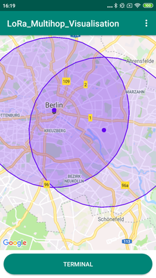
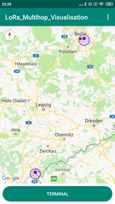
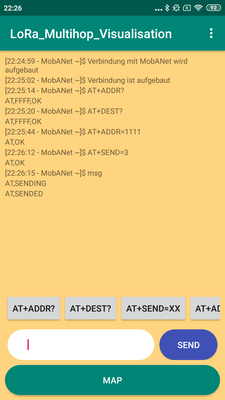
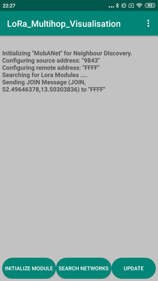
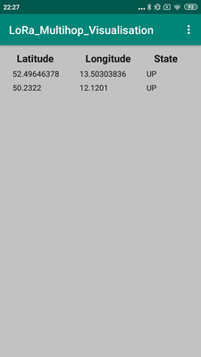
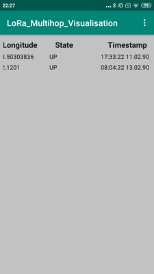

# Neighbour Discovery for Ad-hoc Multi-hop Networks with LoRa and Android
> Screenshots








## Table of Contents

* [About the Project](#about-the-project)
  * [Built With](#built-with)
* [Getting Started](#getting-started)
  * [Prerequisites](#prerequisites)
* [Usage](#usage)


## About The Project
This project contains a prototype for a neighbour discovery algorithm based on LoRa modules.
The application communnicates via bluetooth transmitted AT-commands to the lora modules.
It was developed as part of a course at the [HTW Berlin](https://www.htw-berlin.de/) ([Applied Computing](https://ai-bachelor.htw-berlin.de/))

See [docs](https://github.com/rico001/LoRa_Multihop_Visualisation/tree/master/docs) for more information about the algorithm.

## Getting Started
*Follow these instructions to build and run the Lora_Multihop_Visualisation*
1. ```git clone https://github.com/rico001/LoRa_Multihop_Visualisation```
3. [Install Android Studio](https://developer.android.com/sdk/index.html).
4. Import the project. Open Android Studio, click `Open an existing Android
   Studio project` and select the project. Gradle will build the project.
5. Connect your Android Device with your Computer
6. Run the app. Click `Run > Run 'app'`. After the project builds you'll be
   prompted to build or launch an emulator. You then can choose your mobile phone. 

## How To Use
In order to use this application you will need at least two lora modules connected with a bluetooth transmitter to send and receive AT-commands.
Each Lora-Node has to be connected to a smartphone that will process the received neighbour discovery protocol messages.

tbd...


## Functions implemented
* Search and connect with bluetooth devices
* send and receive AT-Commands
* View current position on map
* search for other lora devices on specific frequency and display their position on the map

